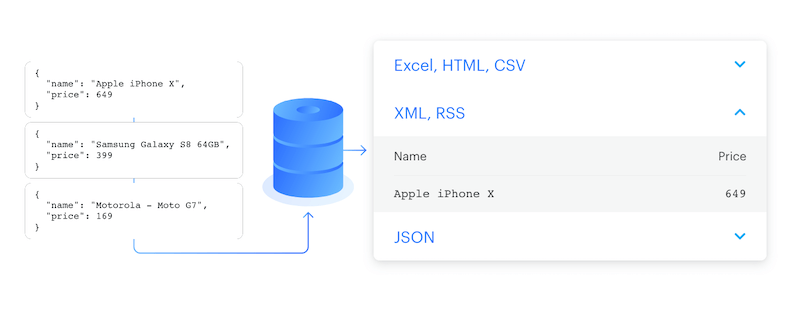
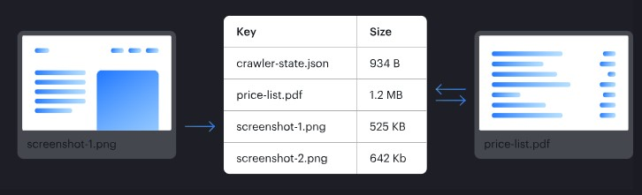
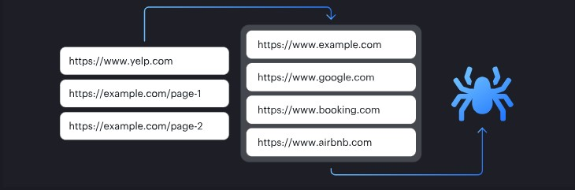
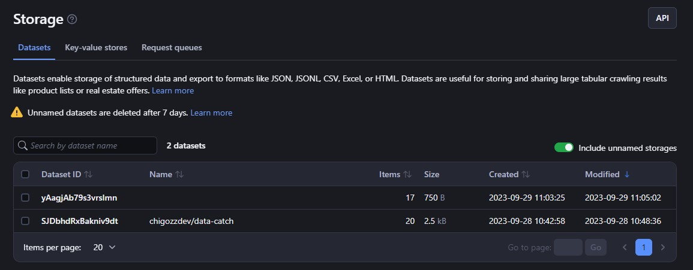
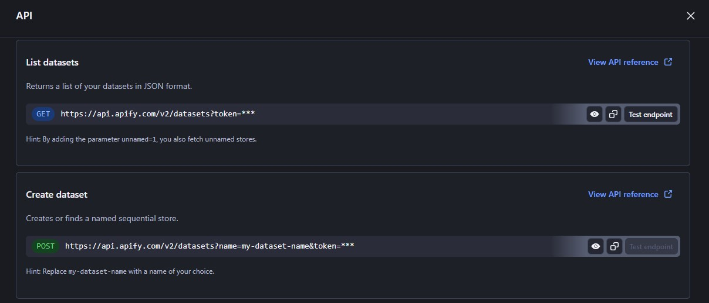
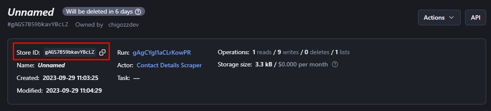

# **Apify Storage Overview**

As your web scraping and automation projects scale, managing all that data gets challenging. Apify offers robust cloud storage solutions to address this pain point. With a few clicks, you can integrate storage into your scripts with Apify's SDKs and API clients too. 


## **1. What is Apify Storage?**

[Apify Storage](https://console.apify.com/storage) provides robust and scalable cloud storage solutions for web scraping, data extraction and automation projects. There are three  main storage options offered by Apify:


* [Dataset](https://docs.apify.com/platform/storage#dataset) - Used to store structured data like JSON or CSV files. Datasets are ideal for storing scraping outputs and structured data extracts. They can handle large amounts of data and scale to any volume.
* [Key-Value Store](https://docs.apify.com/platform/storage#key-value-store) - Used to store arbitrary data like text, files, images and more. It provides a simple key-value interface to store unstructured data at scale.
* [Request Queue](https://docs.apify.com/platform/storage#request-queue) - A queue of URLs to crawl and scrape via your Actors or API. It handles the queueing and throttling of URLs for web scraping.

The storage integrates seamlessly with Apify [Actors](https://docs.apify.com/platform/actors) enabling robust scraping and automation. Apify storage can be easily managed via the Apify console or accessed programmatically using the JavaScript and Python SDKs.


## **2. Types of Apify Storage**

As mentioned earlier, Apify provides three main storage options: Datasets, Key-Value Stores, and Request Queues. Let's explore what each one offers and some resources on configuring them for your specific needs:


### **2.1 Dataset**



The [Dataset](https://docs.apify.com/platform/storage/dataset) storage option allows you to store structured data like JSON, CSV or XML files at scale. It is ideal for managing scraping results, crawling output and other data pipeline outputs. Datasets make it easy to export your scraped data in a variety of formats including JSON, CSV, XML, RSS, Excel and HTML.

The [Apify Console](https://console.apify.com/storage?tab=datasets) provides a user-friendly interface to view, download or edit your datasets. You can configure dataset properties like name, description and more. Moreover, you can also use the [JavaScript SDK](https://docs.apify.com/sdk/js/reference/class/Dataset), [Python SDK](https://docs.apify.com/sdk/python/reference/class/Dataset), [JavaScript API client](https://docs.apify.com/api/client/js/reference/class/DatasetClient), and [Python API client](https://docs.apify.com/api/client/python#datasetclient). The APIs allow you to create, update, get or delete datasets as needed. You can build robust workflows to optimize your datasets.

The Dataset storage scales automatically to handle data of any volume. The remote storage and API access make datasets perfect for serverless web scraping and automation projects. Check out the Apify [dataset documentation](https://docs.apify.com/platform/storage/dataset) for more details on usage, options and code samples.


### **2.2 Key-value Store**



The [Key-Value Store](https://docs.apify.com/platform/storage/key-value-store) provides flexible storage for arbitrary data like files, images and web page screenshots. Each record is accessed via a unique key for fast reads and writes. It's ideal for persisting Actor state or saving unstructured data like PDFs. The Apify Console gives an intuitive interface to view, download or configure key-value store properties.

The [Apify Console](https://console.apify.com/storage?tab=keyValueStores) provides an easy interface to view, download, and edit the stored data and properties. You can also manage key-value stores programmatically via the [JavaScript SDK](https://docs.apify.com/sdk/js/reference/class/KeyValueStore), [Python SDK](https://docs.apify.com/sdk/python/reference/class/KeyValueStore), [JavaScript API client](https://docs.apify.com/api/client/js/reference/class/KeyValueStoreClient), [Python API client](https://docs.apify.com/api/client/python/reference/class/KeyValueStoreClient), or [Apify API](https://docs.apify.com/api/v2#/reference/key-value-stores). 

The Key-Value Store documentation covers managing stores and access best practices. In summary, the key-value store enables fast read/write access to named data records, with options for both UI and API management.


### **2.3 Request Queue**



[Request Queue](https://docs.apify.com/platform/storage/request-queue) handles the dynamic queueing of URLs for recursive web crawling. As new links are discovered, they are added to the queue while avoiding duplicates. This enables efficient large-scale crawls. The Apify Console provides an intuitive interface to view or configure queue properties.

You can also use the [JavaScript SDK](https://docs.apify.com/sdk/js/reference/class/RequestQueue), [Python SDK](https://docs.apify.com/sdk/python/reference/class/RequestQueue), [JavaScript API client](https://docs.apify.com/api/client/js/reference/class/RequestQueueClient), and [Python API client](https://docs.apify.com/api/client/python/reference/class/RequestQueueClient). These APIs allow you to seamlessly add, get or delete queue requests as needed.

Request Queues automatically scale to large volumes of URLs. The remote queueing and APIs make them perfect for serverless crawlers. See the request queue documentation for more details on usage, options and code samples.


## **3. Basic Usage**

Here are six ways to access and use your Apify storage:


* [Apify Console](https://console.apify.com/storage)
* [JavaScript SDK](https://docs.apify.com/sdk/js/docs/guides/request-storage)
* [Python SDK](https://docs.apify.com/sdk/python/docs/concepts/storages)
* [JavaScript API](https://docs.apify.com/api/client/js)
* [Python API client](https://docs.apify.com/api/client/python)
* [Apify API](https://docs.apify.com/api/v2#/reference/key-value-stores)


### **3.1 Apify Console**

Access your storages easily from the Apify Console. In the left sidebar, click on [Storage](https://console.apify.com/storage). Here you can view key-value stores, datasets, request queues, and API endpoints. To see details, click a storage's **ID**. 



>By default, only named storages appear. Check Include unnamed checkbox at the right hand side to show all.

To rename a storage, click its ID or name on the detail page. Under Settings, [grant access](https://docs.apify.com/platform/collaboration) to other Apify users. Quickly share storage contents and details by sharing the API tab's URLs. 



These endpoints access your data. Read endpoints don't need [authentication tokens](https://docs.apify.com/api/v2#/introduction/authentication), so share freely. 

>Update and delete operations require the token, so never share those URLs. They compromise account security. If data requires the token, first download, then share the file.


### **3.2 JavaScript SDK and Crawlee**

The [Apify JavaScript SDK](https://docs.apify.com/sdk/js) is a JavaScript/Node.js library that provides tools to build your own Actors. [Crawlee](https://crawlee.dev/) is another JavaScript/Node.js library that allows you to build web scraping and automation solutions (it was formerly part of the JavaScript SDK). Both libraries require Node.js 16 or later.

See the [Crawlee documentation](https://crawlee.dev/docs/quick-start) for setup instructions and to learn how to build your own crawlers and run them on the Apify platform.


### **3.3 Python SDK**

The [Apify SDK for Python](https://docs.apify.com/sdk/python) is the official library for building Apify Actors with Python. The SDK handles many of the complexities of running actors on the Apify platform. This frees you to focus on your actor's core logic while leveraging the Apify infrastructure. The SDK's utilities and abstractions make it easier to develop, debug and deploy Python actors.


### **3.4 JavaScript API Client**

Use [Apify's JavaScript API client](https://docs.apify.com/api/client/js) to access your datasets from any Node.js app. The client works both on the Apify platform and other places. See the [documentation](https://docs.apify.com/api/client/js/docs) for help getting started with the client.


### **3.5 Python API Client**

The Apify [Python API client](https://docs.apify.com/sdk/python) (apify-client) allows you to access your datasets from any Python application, whether running on the Apify platform or elsewhere. Overall, the Apify Client is the official library for interacting with the Apify API from web browser, Node.js, JavaScript and TypeScript applications.See the [Python client's documentation](https://docs.apify.com/api/client/python/docs/quick-start) for help with setup.


### **3.6 Apify API**

When accessing your Apify storages via the [Apify API](https://docs.apify.com/api/v2#/reference/key-value-stores), you will typically need to provide a **store ID**. You can specify the ID in these formats:


* `AbC1d23EfG4h56I7` - The store's alphanumeric ID if unnamed
* `store~name` - The store's name prefixed with a tilde (~) if named (e.g. ~mystore-scraping-results).
* username~store-name - Username and store name separated by a tilde if the named store belongs to a different account (e.g. janedoemy~store-scraping-results). In this case, the store owner needs to grant you access first.

For `Get` requests, the alphanumeric ID is enough since it's hard to guess and serves as an authentication key. 

With other request types and when using the username~store-name format, you will need to provide your secret API token in the [Authorization](https://docs.apify.com/api/v2#/introduction/authentication) header or as a query parameter. You can find your token on the Integrations page of your Apify account.

See the [API documentation](https://docs.apify.com/api/v2#/reference/datasets) for details and a breakdown of each storage API endpoint.


## **4. Rate Limiting**

Apify API limits how many requests you can make per second to protect its servers from overloading. The default limit is 30 requests per second for each storage object you access, with two exceptions:


* [Pushing](https://docs.apify.com/api/v2#/reference/datasets/item-collection/put-items) items to a dataset - limited to `200` requests per second
* [Adding](https://docs.apify.com/api/v2#/reference/request-queues/request-collection/add-request), [getting](https://docs.apify.com/api/v2#/reference/request-queues/request-collection/get-request), [updating](https://docs.apify.com/api/v2#/reference/request-queues/request-collection/update-request), or [deleting](https://docs.apify.com/api/v2#/reference/request-queues/request-collection/delete-requesthttps://docs.apify.com/api/v2#/reference/request-queues/request-collection/delete-request) requests in a request queue - limited to `200` requests per second

If you send too many requests, the API will respond with an HTTP status code `429` ("Too Many Requests") and this message:


```json
{
    "error": {
        "type": "rate-limit-exceeded",
        "message": "You have exceeded the rate limit of ... requests per second"
    }
}
```


Check the [Apify API documentation](https://docs.apify.com/api/v2#/introduction/rate-limiting) if you need a more in-depth understanding of the API rate limiting.


## **5. Data Retention**

Apify has two types of storages - unnamed and named. They expire after different lengths of time:


* **Unnamed** storages expire after 7 days
* **Named** storages are kept indefinitely


### **5.1 Named Vs. Unnamed Storages**

The default storages for an Actor run disappear after 7 days (or longer on paid plans). This frees up your storage space since they don't have names - just IDs. If you want to keep a storage, [give it a name](https://docs.apify.com/platform/storage#preserving-storages). Named storages stick around indefinitely.

>Storage names can be up to `63` characters long.

Named and unnamed storages work the same way. The only difference is that named ones are easier to recognize later.

For example, it's easier to tell `janedoemy-storage-1` and `janedoeweb-scrape-results` apart than `cAbcYOfuXemTPwnIB` and `CAbcsuZbp7JHzkw1B`.

 


### **5.2 Preserving Your Storages**

To keep your storages forever, give them names. You can do this in the Apify Console or API. First get the storage ID from the run details that created it.

In the Console, check the Dataset, Key-value store, or Request queue tab for that run. The storage ID is in the details. Go to the Storage menu, open the right tab, and toggle on "**Include unnamed**" storages. Find your storage by **ID**, open its Settings, and enter a name. It will now stick around indefinitely.



For the API, get the storage ID from the run using [Get run](https://docs.apify.com/api/v2#/reference/actor-runs/run-object-and-its-storages/get-run). Then name it with [Update dataset](https://docs.apify.com/api/v2#/reference/datasets/dataset/update-dataset) (or the other storage type).

The [JavaScript SDK](https://docs.apify.com/sdk/js), [Crawlee](https://crawlee.dev/), [Python SDK](https://docs.apify.com/api/client/js/), and [JavaScript/Python](https://docs.apify.com/api/client/python/) clients offers their own ways to name storages - check their docs.


## **6. Sharing**

You can let other Apify users view or change your storages using the [access rights](https://docs.apify.com/platform/collaboration) system. This allows you to give different permission levels to different users.


### **6.1 Sharing Storages Between Runs**

You can access any storage from any [Actor](https://docs.apify.com/platform/actors) or [task](https://docs.apify.com/platform/actors/running/tasks) if you know its **name** or **ID**. Manage storages from other runs using the same methods as your current run.

Multiple Actors can read and write to datasets and key-value stores at the same time. This means several Actors running together can add data to one dataset or store. They can also read data from these storages together.

Only one Actor or task can process a request queue at once. But many can add data to it.

>When multiple runs are written to a storage simultaneously, the data order is unpredictable. It's written whenever the request is handled. Same for deleting records - if a delete happens right before a read, the read will fail.


## **7. Deleting Storages**

Named storages are deleted only when you ask for it. Here's how you can remove them:


* **Apify Console:** Click the 'Actions' button on the storage's detailed page.
* **JavaScript SDK and Python SDK:** Use the `.drop()` method in classes like Dataset, Key-value store, or Request queue.
* **JavaScript and Python API Clients:** Opt for the `.delete()` method when dealing with dataset, key-value store, or request queue clients.
* **API:** Choose the 'Delete `[store]`' option, where '[store]' represents the storage type you wish to remove.