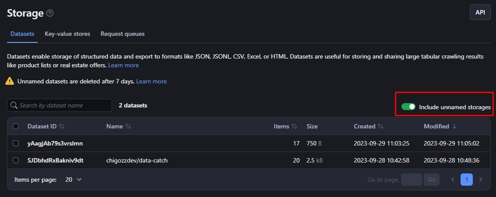
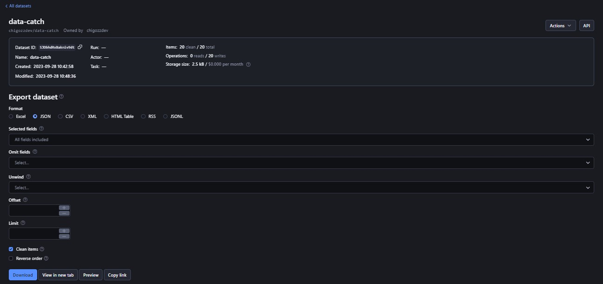

# **Dataset**

The Apify Dataset storage option allows you to store structured data like JSON, CSV or XML at any scale. It is ideal for scraping results, crawling outputs, and data pipeline outputs. Datasets make it easy to export data and are optimized for serverless web scraping workflows. The storage auto-scales and APIs allow robust access.

>Named datasets stay forever. Unnamed datasets expire after 7 days unless you say otherwise. 

## **1. Basic Usage**

Here are 6 ways to use Apify Dataset storage:


* [Apify Console](https://console.apify.com/storage?tab=datasets)
* [JavaScript SDK](https://docs.apify.com/sdk/js/docs/guides/result-storage#dataset)
* [Python SDK](https://docs.apify.com/platform/storage/sdk/python/docs/concepts/storages#working-with-datasets)
* [JavaScript API](https://docs.apify.com/api/client/js/reference/class/DatasetClient)
* [Python API client](https://docs.apify.com/api/client/python/reference/class/DatasetClient)
* [Apify API](https://docs.apify.com/api/v2#/reference/datasets)


### **1.1 Apify Console**

In [Apify Console](https://console.apify.com/), you can see your datasets under [Storage](https://console.apify.com/storage) > [Datasets](https://console.apify.com/storage?tab=datasets). Only named datasets show by default. Check "**Include unnamed storages**" to see all datasets.



To view or download a dataset, click its Dataset ID. Under Settings, you can update the name, [retention time](https://docs.apify.com/platform/storage), and [access rights](https://docs.apify.com/platform/collaboration). 



Click API to see the [API endpoints](https://docs.apify.com/api/v2#/reference/datasets) for the dataset.


### **1.2 JavaScript SDK**

When building a JavaScript [Actor](https://docs.apify.com/platform/actors), you use the [JavaScript SDK](https://docs.apify.com/sdk/js/docs/guides/result-storage#dataset). The dataset is represented by the [Dataset](https://docs.apify.com/sdk/js/reference/class/Dataset) class. You can use this class to specify whether your data is stored locally or in the Apify cloud, and to push data to the datasets of your choice using the <code>[pushData()](https://docs.apify.com/sdk/js/reference/class/Dataset#pushData)</code> method. You can also use other methods, such as <code>[getData()](https://docs.apify.com/sdk/js/reference/class/Dataset#getData)</code>, <code>[map()](https://docs.apify.com/sdk/js/reference/class/Dataset#map)</code>, and <code>[reduce()](https://docs.apify.com/sdk/js/reference/class/Dataset#reduce)</code>. More information can be found in the [example](https://docs.apify.com/sdk/js/docs/examples/map-and-reduce).

If you have chosen to store your dataset locally, you can find it in the following location:


```bash
{APIFY_LOCAL_STORAGE_DIR}/datasets/{DATASET_ID}/{INDEX}.json
```


`DATASET_ID` refers to the dataset's **name** or** ID**. The default dataset will be stored in the **default** directory. To add data to the default dataset, you can use the following example:


```js
// Import the JavaScript SDK into your project
import { Actor } from 'apify';

await Actor.init();

// ...

// Add one item to the default dataset
await Actor.pushData({ foo: 'bar' });

// Add multiple items to the default dataset
await Actor.pushData([{ foo: 'hotel' }, { foo: 'cafe' }]);

// ...

await Actor.exit();
```


Be sure to use the await keyword when calling `pushData()`, otherwise the Actor process might finish before the data is stored. If you want to use something other than the default dataset, such as a dataset that you share between Actors or between Actor runs, you can use the <code>[Actor.openDataset()](https://docs.apify.com/sdk/js/reference/class/Actor#openDataset)</code> method.


```bash
import { Actor } from 'apify';

await Actor.init();

// ...

// Save a named dataset to a variable
const dataset = await Actor.openDataset('some-name');

// Add data to the named dataset
await dataset.pushData({ foo: 'bar' });

// ...

await Actor.exit();
```


When using the <code>[getData()](https://docs.apify.com/sdk/js/reference/class/Dataset#getData)</code> method, you can specify the data you retrieve using the fields option. This should be an array of field names (strings) that will be included in the results. To include all the results, exclude the fields parameter.


```js
import { Actor } from 'apify';

await Actor.init();

// ...

const dataset = await Actor.openDataset();

// Only get the 'hotel' and 'cafe' fields
const hotelAndCafeData = await dataset.getData({
  fields: ['hotel', 'cafe'],
});

// ...

await Actor.exit();
```


For more information on managing datasets with the JavaScript SDK, see the [JavaScript SDK documentation](https://docs.apify.com/sdk/js/docs/guides/result-storage#dataset) and the Dataset class's [API reference](https://docs.apify.com/sdk/js/reference/class/Dataset).


### **1.3 Python SDK**

To use datasets in Python [Actor](https://docs.apify.com/platform/actors), you will be using the [Python SDK](https://docs.apify.com/sdk/python/docs/concepts/storages#working-with-datasets). The dataset is represented by a [Dataset](https://docs.apify.com/sdk/python/reference/class/Dataset) class. This class allows you to specify whether your data is stored locally or in the Apify cloud, and to push data to the datasets of your choice.

If you have chosen to store your dataset locally, you can find it in the following location:


```bash
{APIFY_LOCAL_STORAGE_DIR}/datasets/{DATASET_ID}/{INDEX}.json
```


`DATASET_ID` refers to the dataset's name or ID. The default dataset will be stored in the default directory.

To add data to the default dataset, you can use the following code:


```py
from apify import Actor

async def main():
    async with Actor:
        # Add one item to the default dataset
        await Actor.push_data({'foo': 'bar'})

        # Add multiple items to the default dataset
        await Actor.push_data([{'foo': 'hotel'}, {'foo': 'cafe'}])
```


If you want to use something other than the default dataset, such as a dataset that you share between Actors or between Actor runs, you can use the <code>[Actor.open_dataset()](https://docs.apify.com/sdk/python/reference/class/Actor#open_dataset) </code>method.


```py
from apify import Actor

async def main():
    async with Actor:
        # Save a named dataset to a variable
        dataset = await Actor.open_dataset(name='some-name')

        # Add data to the named dataset
        await dataset.push_data({'foo': 'bar'})
```


When using the <code>[get_data()](https://docs.apify.com/sdk/python/reference/class/Dataset#get_data)</code> method, you can specify the data you retrieve using the fields option. This should be an array of field names (strings) that will be included in the results. To include all the results, exclude the fields parameter.


```py
from apify import Actor

async def main():
    async with Actor:
        dataset = await Actor.open_dataset()

        # Only get the 'hotel' and 'cafe' fields
        hotel_and_cafe_data = await dataset.get_data(fields=['hotel', 'cafe'])
```


For more information on managing datasets with the Python SDK, see the [Python SDK documentation](https://docs.apify.com/sdk/python/docs/guides/result-storage#dataset) and the Dataset class's [API reference](https://docs.apify.com/sdk/python/reference/class/Dataset).


### **1.4 JavaScript API Client**

Apify has a [JavaScript API](https://docs.apify.com/api/client/js/reference/class/DatasetClient) that lets you use your datasets in any Node.js app, whether it's running on Apify or not. 

First, import the API and create a new client object. Then, save each dataset to a variable for easy access.


```js
const myDatasetClient = apifyClient.dataset('jane-doe/my-dataset');
```


Moreover, you can then use the variable to access the dataset's items and manage it.


When using the <code>[.listItems()](https://docs.apify.com/api/client/js/reference/class/DatasetClient#listItems)</code> method, if you mention the same field name in the `field` and `omit` parameters, the omit parameter will take precedence and the field will not be returned.

For more information on [how to set up](https://docs.apify.com/api/client/js/docs) and use the JavaScript API client, see the [documentation](https://docs.apify.com/api/client/js/reference/class/DatasetClient).


### **1.5 Python API Client**

The [Apify Python API](https://docs.apify.com/api/client/python/reference/class/DatasetClient) client lets you access your datasets from any Python program. This works if the program is on Apify or somewhere else.

First, import and start the client. Then, save each dataset to a variable. This makes them easier to access later.


```py
my_dataset = apify_client.dataset('jane-doe/my-dataset')
```


Use that variable to get the [dataset's items](https://docs.apify.com/api/client/python/reference/class/DatasetClient) and manage it.

When using <code>[.list_items()](https://docs.apify.com/api/client/python/reference/class/DatasetClient#list_items)</code>, if you list the same field name twice - in both field and omit - omit will be used. The field won't be returned.

See the [Python API docs](https://docs.apify.com/api/client/python/reference/class/DatasetClient) for [help with setup](https://docs.apify.com/api/client/python/docs/quick-start) and more details.


### **1.6 Apify API**

The [Apify API](https://docs.apify.com/api/v2#/reference/datasets) lets you access your datasets programmatically using HTTP requests.

If you are accessing your datasets using the **username~store-name** [store ID format](https://docs.apify.com/platform/storage), you will need to use your [secret API token](https://docs.apify.com/platform/integrations#api-token). You can find the token (and your user ID) on the [Integrations](https://console.apify.com/account#/integrations) page of your Apify account.

>When providing your API authentication token, we recommend using the request's Authorization header, rather than the URL. ([More info](https://docs.apify.com/platform/storage/dataset#introduction/authentication)).

For example, to [get a list of your datasets](https://docs.apify.com/api/v2#/reference/datasets/get-list-of-datasets), you would send a GET request to the following endpoint:


```bash
https://api.apify.com/v2/datasets
```


To get information about a specific dataset, such as its creation time and item count, you would send a GET request to the following endpoint, replacing `{DATASET_ID}` with the **ID** of the dataset you want to get information about:


```bash
https://api.apify.com/v2/datasets/{DATASET_ID}
```


To view the data in a dataset, you would send a `GET` request to the following endpoint, replacing `{DATASET_ID}` with the **ID** of the dataset you want to view:


```bash
https://api.apify.com/v2/datasets/{DATASET_ID}/items
```


You can specify which fields to export by adding a comma-separated list of field names to the fields query parameter. You can also omit certain fields using the omit query parameter.

If you specify and omit the same field in a request, the omit parameter will take precedence and the field will not be returned.

You can also set the format in which you retrieve the data using the ?format= parameter. The available formats are **json**, **jsonl**, **csv**, **html**, **xlsx**, **xml**, and **rss**. The default value is json.

To retrieve the hotel and cafe fields, you would send your `GET` request to the following URL:


```bash
https://api.apify.com/v2/datasets/{DATASET_ID}/items?format=json&fields=hotel%2Cc
```


>Instead of commas, you will need to use the `%2C` code, which represents `,` in URL encoding.

To add data to a dataset, you would send a POST request to the following endpoint, replacing `{DATASET_ID}` with the **ID** of the dataset you want to add data to:


```bash
https://api.apify.com/v2/datasets/{DATASET_ID}/items
```


The payload of the `POST` request should be a `JSON` object containing the data you want to add to the dataset.

>Pushing data to a dataset via the API is limited to `200` requests per second to prevent our servers from being overloaded.

Here is an example of a payload for a POST request to add data to a dataset:


```json
[
    {
        "foo": "bar"
    },
    {
        "foo": "hotel"
    },
    {
        "foo": "cafe"
    }
]
```


For more information, see the [Apify API documentation](https://docs.apify.com/api/v2#/reference/datasets).


## **2. Hidden fields**

Fields starting with "**#**" are hidden. You can skip these when downloading data by using `skipHidden=1` or clean=1. This lets you store debug info that should not be in the final dataset.

Here is an example record with hidden fields:


```json
{
    "url": "https://example.com", 
    "title": "Example page",
    "data": {
        "foo": "bar" 
    },
    "#error": null,
    "#response": {
        "statusCode": 201
    }
}
```


Data without the hidden fields is called "clean." You can download it from the [Apify Console](https://console.apify.com/storage?tab=datasets) "**Clean items**" link. Or use `clean=true` or `clean=1` in the API.


## **3. XML Format Extension**

When you export results to XML or RSS, the names of the properties in your JavaScript object become XML tags, and the values of those properties become the text inside the tags.

For example, the following JavaScript object:


```json
{
    name: "Rashida Jones",
    address: [
        {
            type: "home",
            street: "21st",
            city: "Chicago",
        },
        {
            type: "office",
            street: null,
            city: null,
        }
    ]
}
```


would be exported to the following XML snippet:


```xml
<name>Rashida Jones</name>
<address>
    <type>home</type>
    <street>21st</street>
    <city>Chicago</city>
</address>
<address>
    <type>office</type>
    <street/>
    <city/>
</address>
```


If a JavaScript object has a property named `@`, the sub-properties of that property are exported as attributes of the parent XML element. If the parent XML element does not have any child elements, its value is taken from a JavaScript object property named `#`.

For example, the following JavaScript object:


```json
{
    "address": [{
        "@": {
            "type": "home",
        },
        "street": "21st",
        "city": "Chicago",
    },
    {
        "@": {
            "type": "office",
        },
        "#": "unknown",
    }]
}
```


would be exported to the following XML snippet:


```xml
<address type="home">
    <street>21st</street>
    <city>Chicago</city>
</address>
<address type="office">unknown</address>
```


This feature can also be used to customize the RSS feeds that Apify generates for websites.

>By default, the whole result is wrapped in an `<items/>` element, and each page object is contained in an `<item/>` element. You can change this using the `xmlRoot` and `xmlRow` URL parameters when you GET your data.


## **4. Sharing**

You can let other Apify users view or change your storages using the [access rights](https://docs.apify.com/platform/collaboration) system. This allows you to give different permission levels to different users.


### **4.1 Sharing Request Queues Between Runs**

You can access a dataset from any [Actor](https://docs.apify.com/platform/actors) or [task](https://docs.apify.com/platform/actors/running/tasks) run as long as you know its name or ID. To do this using the JavaScript SDK or the Python SDK, use the same method as you would to open any other dataset.


```js
import { Actor } from 'apify';

await Actor.init();

const otherDataset = await Actor.openDataset('old-dataset');
// ...

await Actor.exit();
```


In the [JavaScript API client](https://docs.apify.com/api/client/js), you can access a dataset by getting [its client](https://docs.apify.com/api/client/js/reference/class/DatasetClient) object. Once you have the client, you can read and write to the dataset just like you would with a dataset from the current run.


```js
const otherDatasetClient = apifyClient.dataset('jane-doe/old-dataset');
```


Likewise, In the [Python API client](https://docs.apify.com/api/client/python), you can access a dataset by getting [its client object](https://docs.apify.com/api/client/python/reference/class/DatasetClient), just like in JavaScript.


```py
other_dataset_client = apify_client.dataset('jane-doe/old-dataset')
```


The same applies for the [Apify API](https://docs.apify.com/platform/storage/dataset#apify-api) - you can use the same endpoints as you would normally do.

See the [Storage overview](https://docs.apify.com/platform/storage#sharing-storages-between-runs) for more information on sharing storages between runs.


## **5. Limits**


* Data storage formats that use columns, like HTML, CSV, and EXCEL, can hold up to 3000 columns. Any data beyond this won't be retrieved.
* If you use the `pushData()` method, there's a size limit. Each piece of data you add must be less than 9MB when turned into JSON. If you're adding a list, each item in the list should be under 9MB, but the whole list can be any size.
* Also, dataset names can have a maximum of 63 letters.


## **6. Rate Limiting**

When you push data to a dataset using the [API](https://docs.apify.com/api/v2#/reference/datasets/item-collection/put-items), you can make up to 200 requests per second per dataset. This helps to protect Apify's servers from being overloaded.

All other dataset API endpoints have a rate limit of 30 requests per second per dataset.

You can find more information about Apify rate limits in the [API documentation](https://docs.apify.com/api/v2#/introduction/rate-limiting). This includes what to do if you exceed the rate limit.
