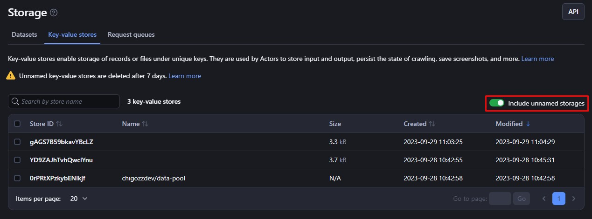
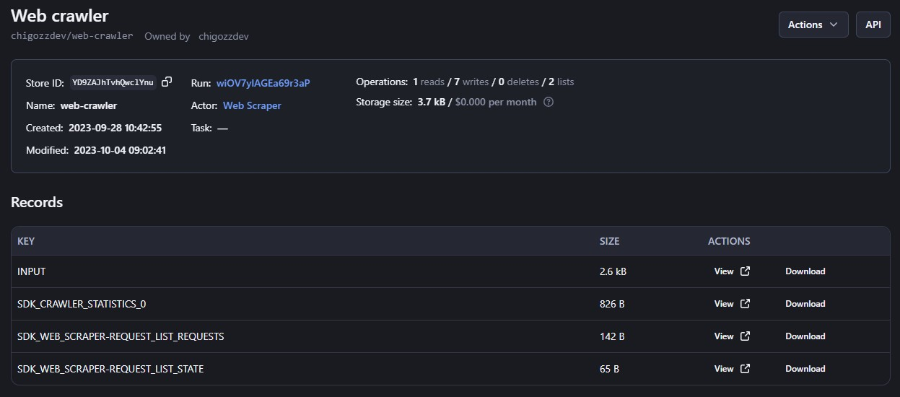

# **Key-value Store**

The key-value store provides simple storage for data like JSON, HTML, images, and strings. Each piece of data is stored with a key to identify it. When an Actor run starts, it gets its own key-value store to hold input and output. Stores are mutable, so you can add and delete entries. 

>Named stores persist indefinitely while unnamed ones expire after 7 days. This basic storage enables flexible data management.


## **1. Basic Usage**

Here are six ways to access and use your Apify Key-value storage:


* [Apify Console](https://console.apify.com/storage?tab=keyValueStores)
* [JavaScript SDK](https://docs.apify.com/sdk/js/docs/guides/result-storage#key-value-store)
* [Python SDK](https://docs.apify.com/platform/storage/sdk/python/docs/concepts/storages#working-with-key-value-stores)
* [JavaScript API](https://docs.apify.com/api/client/js/reference/class/KeyValueStoreClient)
* [Python API Client](https://docs.apify.com/api/client/python/reference/class/KeyValueStoreClient)
* [Apify API](https://docs.apify.com/api/v2#/reference/key-value-stores/get-items)


### **1.1 Apify Console**

The [Apify Console](https://console.apify.com/) lets you access and manage your key-value stores under the [Storage](https://console.apify.com/storage) section on the [Key-value stores](https://console.apify.com/storage?tab=keyValueStores) tab.

Only stores with names show up by default. Check the box called "**Include unnamed storages**" to see all your stores.




To look at what's in a store, click on its Store ID. On the Settings tab, you can change a store's name (which also changes [how long it's kept](https://docs.apify.com/platform/storage)) and [who can access it](https://docs.apify.com/platform/collaboration). 



Click the API button to see and try out the store's [API endpoints](https://docs.apify.com/api/v2#/reference/key-value-stores).


### **1.2 JavaScript SDK**

If you are building a JavaScript [Actor](https://docs.apify.com/platform/actors), you will use the [JavaScript SDK](https://docs.apify.com/sdk/js/docs/guides/result-storage#key-value-store). The key-value store is represented by a [KeyValueStore](https://docs.apify.com/sdk/js/reference/class/KeyValueStore) class. You can use the class to specify if your data is stored locally or in the Apify cloud. You can get and set values using the [getValue()](https://docs.apify.com/sdk/js/reference/class/KeyValueStore#getValue) and [setValue()](https://docs.apify.com/sdk/js/reference/class/KeyValueStore#setValue) methods. You can also iterate over your key-value store keys using the [forEachKey()](https://docs.apify.com/sdk/js/reference/class/KeyValueStore#forEachKey) method.

Each Actor run has a default key-value store created for it. When running Actors locally, you can pass [input](https://docs.apify.com/platform/actors/running/input-and-output) using the **INPUT.json** file in the default key-value store directory. You can find INPUT.json and other files in this location:


```bash
{APIFY_LOCAL_STORAGE_DIR}/key_value_stores/{STORE_ID}/{KEY}.{EXT}
```


The **default** store's ID is "default". `{KEY}` is the record's key. `{EXT}` is the record value's [MIME content type](https://developer.mozilla.org/en-US/docs/Web/HTTP/Basics_of_HTTP/MIME_types/Common_types).

You can use these methods to manage your key-value stores. See the <code>[KeyValueStore](https://docs.apify.com/sdk/js/reference/class/KeyValueStore)</code> class documentation for the full list of available methods.


```js
import { Actor } from 'apify';

await Actor.init();
// ...

// Get the default input
const input = await Actor.getInput();

// Open a named key-value store
const exampleStore = await Actor.openKeyValueStore('my-store');

// Read a record in the exampleStore storage
const value = await exampleStore.getValue('some-key');

// Write a record to exampleStore
await exampleStore.setValue('some-key', { foo: 'bar' });

// Delete a record from exampleStore
await exampleStore.setValue('some-key', null);

// ...
await Actor.exit();
```


>JSON data is automatically converted into a JavaScript object when received. Text information is returned as a string, and other data types are returned as binary data.


```js
import { Actor } from 'apify';

await Actor.init();
// ...

// Get input of your Actor
const input = await Actor.getInput();
const value = await Actor.getValue('my-key');

// ...
await Actor.setValue(
    'OUTPUT',
    imageBuffer,
    { contentType: 'image/jpeg' },
);

// ...
await Actor.exit();
```


The `Actor.getInput()` method is a shortcut for calling `Actor.getValue('INPUT')`, but it also works with the `Actor.metamorph()` method. This is because the input for a metamorphosed actor run is stored in the **INPUT-METAMORPH-1** key instead of the **INPUT** key, which stores the original input.

The `Actor.metamorph()` method allows you to transform an actor run into a new actor run with different input and output. For example, you could use it to create a new actor run that processes the output of another actor run.

To learn more about managing key-value stores with the JavaScript SDK, see the [JavaScript SDK documentation](https://docs.apify.com/sdk/js/docs/guides/result-storage#key-value-store) and the KeyValueStore class's [API reference](https://docs.apify.com/sdk/js/reference/class/KeyValueStore).


### **1.3 Python SDK**

			

Apify provides a [Python SDK](https://docs.apify.com/sdk/python/docs/concepts/storages#working-with-key-value-stores) that you can use to store data in your Python [Actors](https://docs.apify.com/platform/actors) . The key-value store is represented by the [KeyValueStore](https://docs.apify.com/sdk/python/reference/class/KeyValueStore) class.

To use the key-value store, you first need to open it. You can open a named key-value store using the `Actor.open_key_value_store()` method. To open the default key-value store, you can use the `Actor.get_value()` and `Actor.set_value()` convenience methods.

Each Actor run is associated with the default key-value store, which is created for the Actor run. When running your Actors and storing data locally, you can pass its input using the **INPUT.json** file in the default key-value store directory.

You can find **INPUT.json** and other key-value store files in the location below.


```bash
{APIFY_LOCAL_STORAGE_DIR}/key_value_stores/{STORE_ID}/{KEY}.{EXT}
```


The default key-value store's **ID** is default. The `{KEY}` is the record's key and `{EXT}` corresponds to the record value's [MIME content type](https://developer.mozilla.org/en-US/docs/Web/HTTP/Basics_of_HTTP/MIME_types/Common_types).

Once you have opened a key-value store, you can read and write records to it using the [get_value()](https://docs.apify.com/sdk/python/reference/class/KeyValueStore#get_value) and [set_value()](https://docs.apify.com/sdk/python/reference/class/KeyValueStore#set_value) methods, respectively. You can also delete records from the key-value store by setting their value to None.

Example:


```py
from apify import Actor
from apify.storages import KeyValueStore

async def main():
    async with Actor:
        # Open a named key-value store
        example_store: KeyValueStore = await Actor.open_key_value_store(name='my-store')

        # Read a record in the example_store storage
        value = await example_store.get_value('some-key')

        # Write a record to example_store
        await example_store.set_value('some-key', {'foo': 'bar'})

        # Delete a record from example_store
        await example_store.set_value('some-key', None)
```


>JSON records are automatically parsed to Python dictionaries. Text data is returned as a string, and other data is returned as a binary buffer.

Example:


```py
from apify import Actor

async def main():
    async with Actor:
        value = await Actor.get_value('my-key')
        # ...
        image_buffer = ...  # Get image data
        await Actor.set_value(key='OUTPUT', value=image_buffer, content_type='image/jpeg')
```


The `Actor.get_input() `method is a shortcut to `Actor.get_value('INPUT')`. It is also compatible with `Actor.metamorph()`. This is because a metamorphosed Actor run's input is stored in the **INPUT-METAMORPH-1** key instead of **INPUT**, which hosts the original input.

For more information, please see the [Python SDK documentation](https://docs.apify.com/sdk/python/docs/guides/result-storage#key-value-store) and the [KeyValueStore class's API reference](https://docs.apify.com/sdk/python/reference/class/KeyValueStore).


### **1.4 JavaScript API Client**

The [Apify JavaScript API client](https://docs.apify.com/api/client/js/reference/class/KeyValueStoreClient) lets you access your key-value stores from any Node.js app. This works if your app is running on Apify or somewhere else.

First, import and initialize the client. Then, save each key-value store to a variable. That makes them easier to access later.


```js
const myStore = apifyClient.keyValueStore('jane-doe/my-store');
```


Now you can use that myStore variable to [get, add, and update items in the key-value store](https://docs.apify.com/api/client/js/reference/class/KeyValueStoreClient).

See the [JavaScript API client docs](https://docs.apify.com/api/client/js/reference/class/KeyValueStoreClient) for [help with setup](https://docs.apify.com/api/client/js/docs) and more details.


### **1.5 Python API Client**

The Apify [Python API client](https://docs.apify.com/api/client/python/reference/class/KeyValueStoreClient) lets you access your key-value stores from any Python app. This works if your app is running on Apify or somewhere else.

First, import and initiate the client. Then, save each key-value store to a variable. That makes them easier to access later.


```py
my_store = apify_client.key_value_store('jane-doe/my-store')
```


Now you can use that my_store variable to [get, add, and update items in the key-value store](https://docs.apify.com/api/client/python/reference/class/KeyValueStoreClient).

See the [Python API client docs](https://docs.apify.com/api/client/python/reference/class/KeyValueStoreClient) for [help with setup](https://docs.apify.com/api/client/python/docs/quick-start) and more details.


### **1.6 Apify API**

The [Apify API](https://docs.apify.com/api/v2#/reference/key-value-stores) lets you use [HTTP requests](https://developer.mozilla.org/en-US/docs/Web/HTTP/Methods) to access your key-value stores and share your crawling results programmatically.

If you use the username~store-name [store ID format](https://docs.apify.com/platform/storage) to access your datasets, you'll need to use your [secret API token](https://docs.apify.com/platform/integrations#api-token). You can find it (and your user ID) on the [Integrations](https://console.apify.com/account#/integrations) page of your Apify account.

>We recommend using the Authorization header in your requests to provide your API authentication token, instead of the URL. ([More info here.](https://docs.apify.com/platform/storage/key-value-store#introduction/authentication))

To [get a list of your key-value stores](https://docs.apify.com/api/v2#/reference/key-value-stores/store-collection/get-list-of-key-value-stores), send a GET request to the following endpoint:


```bash
https://api.apify.com/v2/key-value-stores
```


To **get information about a key-value store**, such as its creation time and item count, send a GET request to the following endpoint, specifying the store ID:


```bash
https://api.apify.com/v2/key-value-stores/{STORE_ID}
```


To **get a record** (its value) from a key-value store, send a GET request to the following endpoint, specifying the store ID and key ID:


```bash
https://api.apify.com/v2/key-value-stores/{STORE_ID}/records/{KEY_ID}
```


To **add a record** with a specific key to a key-value store, send a PUT request to the following endpoint, specifying the store ID and key ID:


```bash
https://api.apify.com/v2/key-value-stores/{STORE_ID}/records/{KEY_ID}
```


Example payload:


```json
{
    "foo": "bar",
    "fos": "baz"
}
```


To **delete a record** from a key-value store, send a **DELETE** request to the following endpoint, specifying the store ID and key ID:


```bash
https://api.apify.com/v2/key-value-stores/{STORE_ID}/records/{KEY_ID}
```


For a detailed breakdown of each API endpoint, see the [Apify API documentation](https://docs.apify.com/api/v2#/reference/key-value-stores).


## **2. Compression**

Records used to always be compressed with Gzip before uploading using the [Put record](https://docs.apify.com/api/v2#/reference/key-value-stores/record/put-record) endpoint. This changed. **Now, records are stored however you upload them. So you choose if the record is compressed or not.**

You can compress a record yourself. Then use the [Content-Encoding header](https://developer.mozilla.org/en-US/docs/Web/HTTP/Headers/Content-Encoding) to tell our platform the compression type. We suggest compressing large records to save space and bandwidth.

If you use the [JavaScript SDK](https://docs.apify.com/sdk/js/reference/class/KeyValueStore#setValue) or [JavaScript API client](https://docs.apify.com/api/client/js/reference/class/KeyValueStoreClient#setRecord), records are compressed automatically. We recommend the JavaScript API client. It compresses data before sending it to our servers. And it decompresses data when you get it back. This makes your storage costs as low as possible.


## **3. Sharing**

You can let other Apify users view or edit your storages using the [access rights](https://docs.apify.com/platform/collaboration) system. This lets you give different [permission levels](https://docs.apify.com/platform/collaboration/list-of-permissions) to different users.


### **3.1 Sharing Request Queues Between Runs**

You can access a key-value store from any [Actor](https://docs.apify.com/platform/actors) or [task](https://docs.apify.com/platform/actors/running/tasks) run as long as you know its name or ID.

To access a key-value store from another run using the [JavaScript SDK](https://docs.apify.com/sdk/js) or the [Python SDK](https://docs.apify.com/sdk/python), open it using the same method as you would for any other store:


```js
import { Actor } from 'apify';

await Actor.init();

const otherStore = await Actor.openKeyValueStore('old-store');

// ...

await Actor.exit();
```


In the [JavaScript API client](https://docs.apify.com/api/client/js), access a store using [its client](https://docs.apify.com/api/client/js/reference/class/KeyValueStoreClient). Once opened, read and manage its contents like any other key-value store from your current run:


```js
const otherStoreClient = apifyClient.keyValueStore('jane-doe/old-store');
```


Likewise in the [Python API client](https://docs.apify.com/api/client/python), access a store using [its client](https://docs.apify.com/api/client/python/reference/class/KeyValueStoreClient):


```py
other_store_client = apify_client.key_value_store('jane-doe/old-store')
```


The same applies for the [Apify API](https://docs.apify.com/platform/storage/key-value-store#apify-api) - you can use [the same endpoints](https://docs.apify.com/platform/storage/key-value-store#apify-api) as usual.

See the [Storage overview](https://docs.apify.com/platform/storage#sharing-storages-between-runs) for details on sharing storages between runs.


## **4. Data consistency**

Key-value storage uses the [Amazon S3](https://aws.amazon.com/s3/) service. The [S3 documentation](https://aws.amazon.com/s3/consistency/) says it has strong read-after-write consistency. This means that after Apify writes data to the storage, any later read will return the updated data. You can trust that the data you read is the latest version written.


## **5. Limits**


* Key-value store names can be up to 63 characters long.