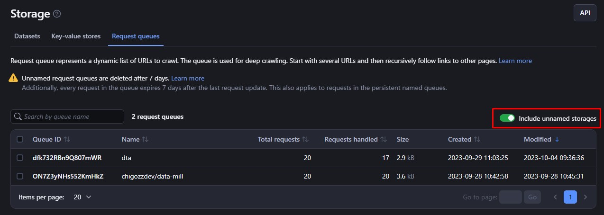
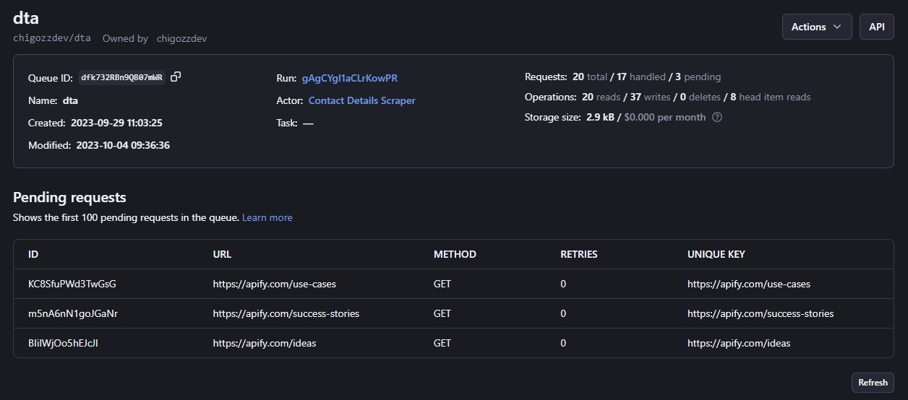

# **Request Queue**

Request queues let you add and get URLs and other requests. They help when you need to process many URLs, like in web crawling. They also help add new links while crawling.

Request queues can crawl websites in breadth-first or depth-first order. You can add custom data too. You can check if a URL was found before, add new URLs, and get the next URLs to process.

>Named queues stay forever. Unnamed queues expire after 7 days unless you say otherwise. Request queues are useful for crawling and processing lots of requests efficiently.


## **1. Basic Usage**

Here are six ways to access and use your Apify Request Queue storage:


* [Apify Console](https://console.apify.com/storage?tab=requestQueues)
* [JavaScript SDK](https://docs.apify.com/sdk/js/docs/guides/result-storage#request-queue)
* [Python SDK](https://docs.apify.com/platform/storage/sdk/python/docs/concepts/storages#working-with-request-queues)
* [JavaScript API](https://docs.apify.com/api/client/js/reference/class/RequestQueueClient)
* [Python API Client](https://docs.apify.com/api/client/python/reference/class/RequestQueueClient)
* [Apify API](https://docs.apify.com/api/v2#/reference/request-queues)


### **1.1 Apify Console**

In [Apify Console](https://console.apify.com/), you can access your request queues in [Storage](https://console.apify.com/storage) > [Request queues](https://console.apify.com/storage?tab=requestQueues).

Only named queues show by default. Check "**Include unnamed storages**" to see all queues. 



Click a **Queue ID** to view a queue. On the Settings tab, you can update the queue's name,[ retention time](https://docs.apify.com/platform/storage), and[ access rights](https://docs.apify.com/platform/collaboration). 




Click API to see and test the queue's [API endpoints](https://docs.apify.com/api/v2#/reference/request-queues).


### **1.2 JavaScript SDK**

When you build a JavaScript [Actor](https://docs.apify.com/platform/actors), you use the [JavaScript SDK](https://docs.apify.com/sdk/js/docs/guides/request-storage#request-queue). The SDK has a <code>[RequestQueue](https://docs.apify.com/sdk/js/reference/class/RequestQueue)</code> class to manage your request queue. This queue holds URLs to crawl.

Each Actor run gets a default request queue when the first request is added. Usually this default queue is used to store URLs for that Actor run. But you can also make named queues to share between Actors or Actor runs.

If you store data locally, the default queue files are in:


```bash
{APIFY_LOCAL_STORAGE_DIR}/request_queues/{QUEUE_ID}/{ID}.json
```


The default request queue's ID is default. Each request is a separate JSON file, where `{ID}` is a request ID.

To open a request queue in your code, call <code>[Actor.openRequestQueue()](https://docs.apify.com/sdk/js/reference/class/Actor#openRequestQueue)</code> method.


```js
// Import the JavaScript SDK into your project
import { Actor } from 'apify';

await Actor.init();
// ...

// Open the default request queue associated with
// the Actor run
const queue = await Actor.openRequestQueue();

// Open the 'my-queue' request queue
const queueWithName = await Actor.openRequestQueue('my-queue');

// ...
await Actor.exit();
```


Once you open a request queue, you can manage it with these `RequestQueue` methods:


* `enqueueRequest()` - Add a request
* `fetchNextRequest()` - Get the next request
* `markRequestHandled()` - Mark a request as finished
* `reclaimRequest()` - Put a request back in the queue

See the `RequestQueue` [API reference](https://docs.apify.com/sdk/js/reference/class/RequestQueue) for the full list of methods you can use.


```js
// Import the JavaScript SDK into your project
import { Actor } from 'apify';

await Actor.init();
// ...

const queue = await Actor.openRequestQueue();

// Enqueue requests
await queue.addRequests([{ url: 'http://example.com/aaa' }]);
await queue.addRequests([
    'http://example.com/foo',
    'http://example.com/bar',
], { forefront: true });

// Get the next request from queue
const request1 = await queue.fetchNextRequest();
const request2 = await queue.fetchNextRequest();

// Get a specific request
const specificRequest = await queue.getRequest('shi6Nh3bfs3');

// Reclaim a failed request back to the queue
// and crawl it again
await queue.reclaimRequest(request2);

// Remove a queue
await queue.drop();

// ...
await Actor.exit();
```


To learn how to manage your request queues with the JavaScript SDK, see the [SDK docs](https://docs.apify.com/sdk/js/docs/guides/request-storage#request-queue) and the `RequestQueue` [API reference](https://docs.apify.com/sdk/js/reference/class/RequestQueue).


### **1.3 Python SDK**

When building a Python [Actor](https://docs.apify.com/platform/actors), the [Python SDK](https://docs.apify.com/sdk/python/docs/concepts/storages#working-with-request-queues) is used. The <code>[RequestQueue](https://docs.apify.com/sdk/python/reference/class/RequestQueue)</code> class represents the request queue. You can use this class to choose whether to store data locally or in the Apify cloud, and to [add new URLs](https://docs.apify.com/sdk/python/reference/class/RequestQueue#add_requests).

Each Actor run has a default request queue, created when the first request is added. Typically, this stores crawl URLs for that specific run, but you don't have to use it. You can also make named queues to share between Actors or runs.


If storing locally, the queue is here:


```bash
{APIFY_LOCAL_STORAGE_DIR}/request_queues/{QUEUE_ID}/{ID}.json
```


The default queue ID is "**default**". Each request is a separate JSON file, where {ID} is the request ID.

To open a request queue, use the <code>[Actor.open_request_queue()](https://docs.apify.com/sdk/python/reference/class/Actor#open_request_queue)</code> method.


```py
from apify import Actor

async def main():
    async with Actor:
        # Open the default request queue associated with the Actor run
        queue = await Actor.open_request_queue()

        # Open the 'my-queue' request queue
        queue_with_name = await Actor.open_request_queue(name='my-queue')

        # ...
```


Once you open a queue, you can manage it using these `RequestQueue` class methods. See the `RequestQueue` [API reference ](https://docs.apify.com/sdk/python/reference/class/RequestQueue)for the full list of available methods.


```py
from apify import Actor
from apify.storages import RequestQueue

async def main():
    async with Actor:
        queue: RequestQueue = await Actor.open_request_queue()

        # Enqueue requests
        await queue.add_request(request={'url': 'http:#example.com/aaa'})
        await queue.add_request(request={'url': 'http:#example.com/foo'})
        await queue.add_request(request={'url': 'http:#example.com/bar'}, forefront=True)

        # Get the next requests from queue
        request1 = await queue.fetch_next_request()
        request2 = await queue.fetch_next_request()

        # Get a specific request
        specific_request = await queue.get_request('shi6Nh3bfs3')

        # Reclaim a failed request back to the queue and crawl it again
        await queue.reclaim_request(request2)

        # Remove a queue
        await queue.drop()
```


To learn how to manage your request queues with the Python SDK, see the [Python SDK documentation](https://docs.apify.com/sdk/python/docs/guides/request-storage#request-queue) and the `RequestQueue` class’s [API reference](https://docs.apify.com/sdk/python/reference/class/RequestQueue).


### **1.4 JavaScript API Client**

You can use Apify's [JavaScript API client](https://docs.apify.com/api/client/js/reference/class/RequestQueueClient) (`apify-client`) to access your request queues from any Node.js application. To do this, you first need to import and initialize the client. Then, you can save each request queue to a variable for easier access. 

For example:


```js
const myQueueClient = apifyClient.requestQueue('jane-doe/my-request-queue');
```


Once you have saved a request queue to a variable, you can use that variable to access the queue's items and manage it. 

For more information on [help with setup](https://docs.apify.com/api/client/js/docs) and more details, see the [JavaScript API client documentation](https://docs.apify.com/api/client/js/reference/class/RequestQueueClient).


### **1.5 Python API Client**

Apify's Python API client (apify-client) enables you to access your request queues from any Python application. To do this, you first need to import and initialize the client. Then, you can save each request queue to a variable for easier access. 

For example:


```py
import apify_client

my_queue_client = apify_client.request_queue('jane-doe/my-request-queue')
```


Once you have saved a request queue to a variable, you can use that variable to [access and manage the queue](https://docs.apify.com/api/client/python/reference/class/RequestQueueClient). 

For more information, see the [Python API client documentation](https://docs.apify.com/api/client/python/reference/class/RequestQueueClient).


### **1.6 Apify API**

The [Apify API](https://docs.apify.com/api/v2#/reference/request-queues) lets you programmatically access your request queues using [HTTP requests](https://developer.mozilla.org/en-US/docs/Web/HTTP/Methods).

If you are accessing your datasets using the `username~store-name` [store ID format](https://docs.apify.com/platform/storage), you will need to use your secret API token. You can find the token (and your user ID) on the [Integrations](https://console.apify.com/account#/integrations) page of your Apify account.

>When providing your API authentication token, we recommend using the request's `Authorization` header, rather than the URL. ([More info](https://docs.apify.com/platform/storage/request-queue#introduction/authentication)).

To [get your queue list](https://docs.apify.com/api/v2#/reference/request-queues/store-collection/get-list-of-request-queues), send a GET request to:


```bash
https://api.apify.com/v2/request-queues
```


To [get queue details](https://docs.apify.com/api/v2#/reference/request-queues/queue/get-request-queue) like creation time and item count, send a GET request to:


```bash
https://api.apify.com/v2/request-queues/{QUEUE_ID}
```


To [get a request](https://docs.apify.com/api/v2#/reference/request-queues/request/get-request), send a GET request to:


```bash
https://api.apify.com/v2/request-queues/{QUEUE_ID}/requests/{REQUEST_ID}
```


To [add a request](https://docs.apify.com/api/v2#/reference/request-queues/request-collection/add-request), send a POST request with the JSON payload to:


```bash
https://api.apify.com/v2/request-queues/{QUEUE_ID}/requests
```


Example payload:


```json
{
  "uniqueKey": "http://example.com",
  "url": "http://example.com",
  "method": "GET"
}
```


To update a request, send a `PUT` request with the JSON payload to:


```bash
https://api.apify.com/v2/request-queues/{QUEUE_ID}/requests/{REQUEST_ID}
```


Example payload:


```json
{
  "id": "dnjkDMKLmdlkmlkmld",
  "uniqueKey": "http://example.com",
  "url": "http://example.com",
  "method": "GET" 
}
```


>When you add or update requests, you can optionally provide a clientKey parameter. This is a string between 1 and 32 characters long that is used to identify the client that is accessing the queue. If you don't provide a clientKey, the system will consider the API call to be coming from a new client. You can see whether the queue was accessed by [multiple clients](https://docs.apify.com/platform/storage/request-queue#sharing) by looking at the hadMultipleClients field returned by the [Get head](https://docs.apify.com/api/v2#/reference/request-queues/queue-head/get-head) operation. E.g client-abc

See the [docs](https://docs.apify.com/api/v2#/reference/request-queues) for details on each endpoint.


## **2. Sharing**

You can let other Apify users view or edit your storages using the [access rights](https://docs.apify.com/platform/collaboration) system. This lets you give different [permission levels](https://docs.apify.com/platform/collaboration/list-of-permissions) to different users.


### **2.1 Sharing Request Queues Between Runs**

You can access a request queue from any [Actor](https://docs.apify.com/platform/actors) or [task](https://docs.apify.com/platform/actors/running/tasks) run, as long as you know its **name** or **ID**. 

To do this using the JavaScript or Python SDK, open the request queue using the same method you would use for any other request queue.


```js
import { Actor } from 'apify';

await Actor.init();

const otherQueue = await Actor.openRequestQueue('old-queue');
// ...

await Actor.exit();
```


Once you have opened the request queue, you can use it in your crawler or add new requests, just like you would with a queue from your current run.

For example, in the JavaScript API client:


```js
const otherQueueClient = apifyClient.requestQueue('jane-doe/old-queue');
```


In the Python API client, you would write:


```py
other_queue_client = apify_client.request_queue('jane-doe/old-queue')
```


You can also use the [Apify API](https://docs.apify.com/platform/storage/request-queue#apify-api) to access request queues. The [endpoints are the same](https://docs.apify.com/platform/storage/request-queue#apify-api) as the ones you would use normally.

For more information on sharing storages between runs, see the [Storage overview](https://docs.apify.com/platform/storage#sharing-storages-between-runs).


## **3. Limits**


* Several Actor or task runs can **add new requests** to a queue at the same time, but only one run can **process the queue** at a time.
* Request queue names can be up to 63 characters long.


## **4. Rate Limiting**

When you manage request queues using the [API](https://docs.apify.com/api/v2#/reference/request-queues/put-items), you can make **200** [create](https://docs.apify.com/api/v2#/reference/request-queues/request-collection/add-request), [read](https://docs.apify.com/api/v2#/reference/request-queues/request-collection/get-request),[ update](https://docs.apify.com/api/v2#/reference/request-queues/request-collection/update-request), and [delete](https://docs.apify.com/api/v2#/reference/request-queues/request-collection/delete-request) (CRUD) requests per second per request queue. This helps to protect Apify servers from being overloaded.

All other request queue API [endpoints](https://docs.apify.com/api/v2#/reference/request-queues) have a limit of **30** requests per second per request queue.

For more details and information on what to do if you exceed the rate limit, see the [API documentation](https://docs.apify.com/api/v2#/introduction/rate-limiting).
